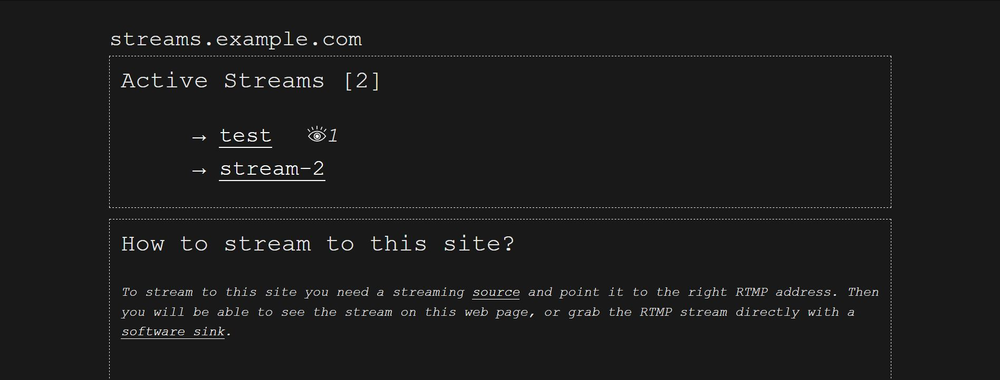

# streamviewer

Streamviewer is a python based web frontend that allows you to view HLS Streams received via NGINX-RTMP. This means users can stream to your server via RTMP, grab the RTMP-stream from there or view the stream live on the website.




## Features

- video.js based web players for live streams
- builds on the nginx rtmp module
- Shows a realtime list of ongoing streams with view counts
- Allows unlisted streams, password protected streams, streams can provide descriptions to be displayed
- Two modes: _free_ (everybody can stream to the server) and a _restricted_ mode (only preconfigured stream keys with password) are available
- Optional Markdown based description can be added with instructions how to stream to the page
- Based on Flask and python3 with minimum external dependecies


Streamviewer is (as of now) mostly stateless, that means there is not database, no accounts, nothing — but it still allows to display the current streams. Users can password protect their stream keys (by adding it to the RTMP URL like `?password=1234`) so others cannot snatch them away, but if the streamviewer service restarts the passwords are lost. This is because streamviewer was made to be used in a local network, where random users streaming undesireable content is not such a big danger.

Maybe there will be a version with accounts (and LDAP support?) in the future, but who knows.


## Todo

- [ ] Design/Add Favicon
- [ ] Finetuning of example HLS configuration
- [ ] Add Footer with link to repo, contact info
- [ ] Option ?start=2021-02-23T21.15 and display a countdown before showing the stream
- [ ] Hot reloading of config/description.md ?
- [ ] Add socketio for single stream pages 
  - [ ] show realtime notices before streams started
  - [ ] after ended
  - [ ] duration of the stream
  - [x] viewer count
- [x] Option to prevent unrestricted usage without preconfigured stream key/password
- [x] Option to "protect" certain stream keys
- [x] Option to have unlisted streams
- [x] Option to predefine passwords per stream key in config
- [x] Try Out Flask socketio integration for realtime listing of current streams


## Nginx Setup

To get going two parts need to work: Nginix and streamviewer.

### 1. Install Nginx + RTMP module

Make sure you install the Nginx  server then additionally install the RTMP module:

```
sudo apt install nginx libnginx-mod-rtmp
```

### 2. Adjust nginx.conf

Add a rtmp block to your `nginx.conf` (located at e.g. `/etc/nginx/nginx.conf`) and make sure to add the types block as well:

```
user www-data;
worker_processes auto;
pid /run/nginx.pid;
include /etc/nginx/modules-enabled/*.conf;

events {
        worker_connections 768;
        # multi_accept on;
}

rtmp { 
    server { 
        listen 1935; 
        chunk_size 4000;
        application live { 
            live on; 
            interleave on;
            on_publish http://localhost/on_publish;
            on_publish_done http://localhost/on_publish_done;
 
            hls on; 
            hls_path /data/hls; 
            hls_fragment 3s; 
            hls_playlist_length 30;

            dash on;
            dash_path /data/dash; 
            dash_fragment 15s; 
        } 
    } 
} 
 
http { 
    default_type application/octet-stream;
 
    types {
        application/vnd.apple.mpegurl m3u8;
        video/mp2t ts;
        text/html html;
        text/css css;
        text/javascript js;
        application/dash+xml mpd;
    } 
include /etc/nginx/sites-enabled/*; 
}
```

### 3. Create a reverse proxy configuration

The create a site configuration at `/etc/nginx/sites-enabled/streamviewer.conf` and set it up as a reverse proxy (see `/examples/streamviewer.conf` for a basic non-https setup)

Run `sudo nginx-t` to test your configuration, if everything is okay restart nginx with `sudo systemctl restart nginx`.

### 4. Testing the RTMP Stream

You should now be able to send a RTMP stream to port 1935 of the server (e.g. from OBS). If this doesn't work make sure the firewall allows you to do this (if you have ufw running on the server allow access using `sudo ufw allow 1935`).
If OBS doesn't give you an error your server seems to receive the stream. Now we can check if the stream can also be grabbed from there: Start VLC Player and enter `rtmp://your.domain.or.ip.address:1935/live/test` as a URL. Replace `test` with the Stream key you made up.


## streamviewer setup

### 1. Install the software

Make sure `python3-venv` is installed:

```bash
sudo apt install python3-venv
```

Then clone the repo and enter it:

```bash
git clone https://code.hfbk.net/dh/streamviewer.git
cd streamviewer
```

Create a new venv environment, activate it and install the dependecies from requirements.txt:
```
python3 -m venv env
source env/bin/activate
pip3 install -r requirements.txt
```

### 2. Configuration

There is a configuration tool that helps. From within the repository run
```
source env/bin/activate
python3 streamviewer/config.py
```
to display the available commands and an explaination what you can do. Write a editable config e.g. to `/etc/streamviewer/00-config.toml` using:
```bash
sudo env/bin/python streamviewer/config.py create
```
Note: Sudo is only needed because your normal user is not allowed to create a directory at /etc. You could also do this without running the script with sudo by:

```bash
sudo mkdir /etc/streamviewer
sudo chown youruser:youruser /etc/streamviewer
python3 streamviewer/config.py create
```

Streamviewer allows you to have multiple configuration files with a clear order where the latter overrides fields of the former. To maintain the overview you can always display the final result by running:

```bash
python3 streamviewer/config.py test
```


### 3. Setup the service
The _streamviewer_ is meant to run behind a reverse proxy server (e.g. Nginx) and as a systemd service on a Linux system. Gunicorn acts as a runner.

1. Create a system user called _wwwrun_: `sudo useradd -r streamviewer`
2. Copy the systemd unit file `examples/streamviewer.service` to `/etc/systemd/system/streamviewer.service` and have a look at it. 
3. Copy the streamviewer directory to `/srv/streamviewer`
4. Create the directory `/srv/streamviewer` 
5. Enable the service via `sudo systemctl enable streamviewer`
6. Start the service via `sudo systemctl start streamviewer`
7. Check the status via `sudo systemctl status streamviewer` or display the log via `sudo journalctl -fu streamviewer`

If you did everything right you should now see a website displaying the current streams with a webplayer

